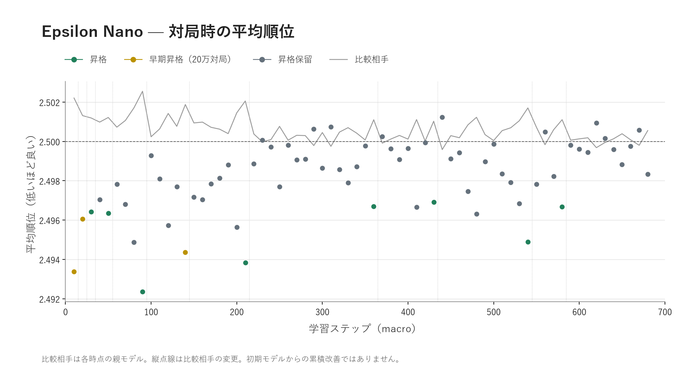
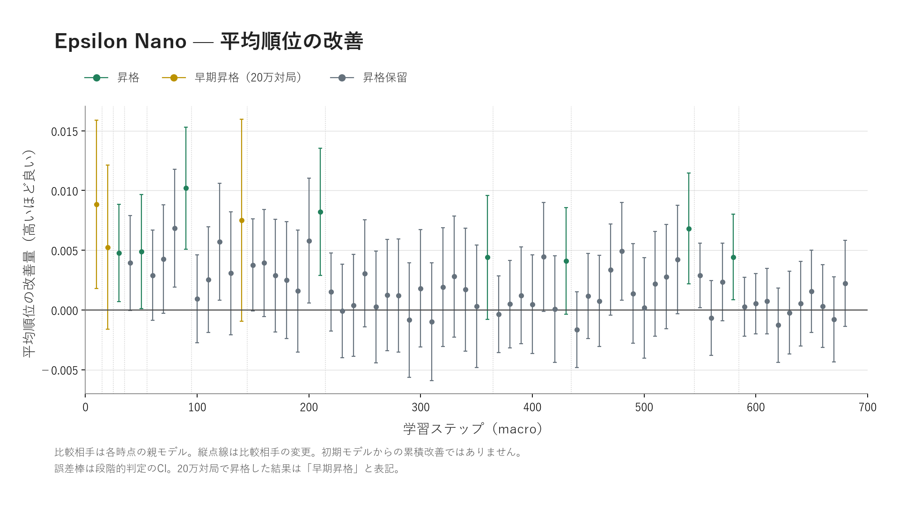
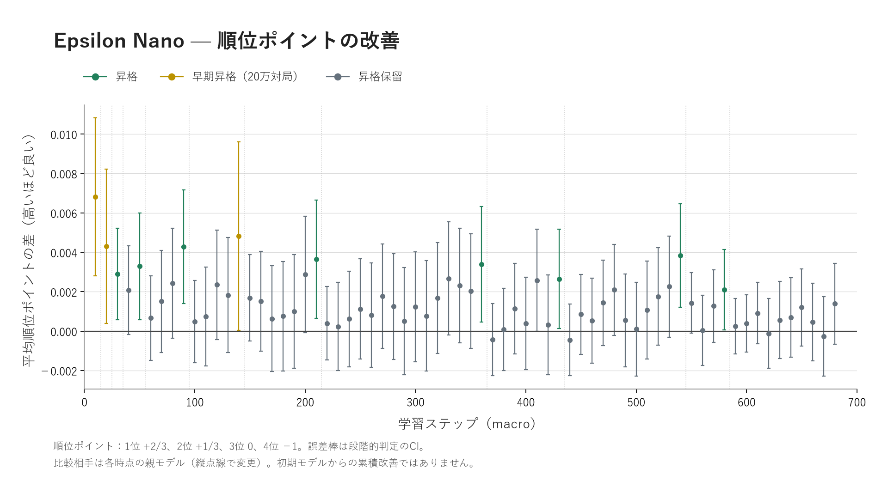
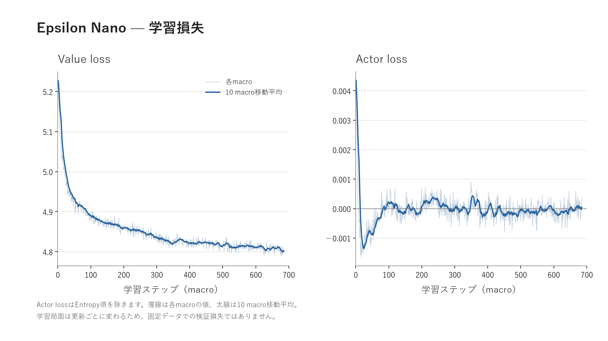
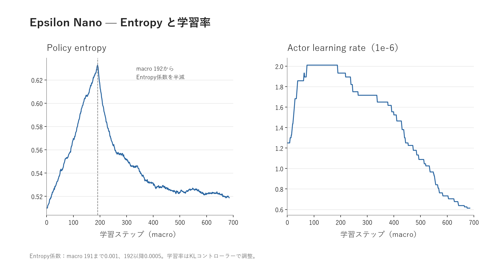
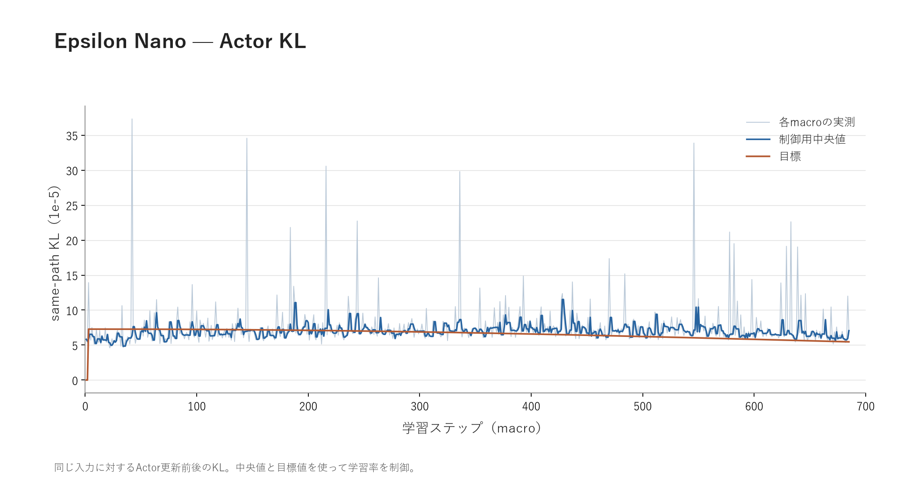

# Epsilon-Nano 学習結果

[対局評価](#対局で確かめた改善) · [学習の推移](#学習の推移と今後の伸びしろ) · [PPOと探索](#ppoと探索のしやすさ)

Epsilon-Nanoは、牌譜からの学習に加えて、自己対戦による追加学習を行っています。このページでは、685 macroの学習と、その途中で行った親モデルとの比較を紹介します。macroは、この記録で用いている学習の進行単位です。

**Nanoは、学習を続ければまだまだ強くなれると期待しています。** 学習後半にも親モデルを上回る更新があり、Value lossも緩やかな低下を続けています。その根拠と、グラフから読み取れる範囲を以下にまとめます。

| 記録の範囲    |                結果 |
|----------|------------------:|
| 学習       |         685 macro |
| 親モデルとの比較 | 68回（macro 10～680） |
| 昇格       |     11回（うち早期昇格3回） |
| 学習半荘数    |        延べ2,244万半荘 |
| 評価半荘数    |        延べ2,660万半荘 |

通常の評価は40万半荘、早期昇格した3回は20万半荘で終了しています。

## 対局で確かめた改善

学習中の候補モデルを、その時点の基準となる「親モデル」と対戦させています。評価で採用された候補は次の親モデルになります。

各図では、緑が昇格、黄色が20万対局での早期昇格、灰色が昇格保留です。縦の点線は、比較相手の親モデルが変わった位置を示します。比較相手が更新されるため、初期モデルからの累積改善を描いたグラフではありません。

### 平均順位

点が候補モデル、灰色の線が親モデルの平均順位です。親モデルより低い点は、その評価で候補の平均順位が良かったことを表します。後半の点が2.5に近づいていても、比較相手が変わっているので、その形だけで初期より弱くなったとは判断できません。

改善量はプラスほど良く、誤差棒は段階的な昇格判定で使う信頼区間です。0をまたぐ結果は、改善した可能性がある一方、平均順位が良くなったと明確に判断するには不確かさが残ります。

### 順位ポイント

この評価では、1位に`+2/3`、2位に`+1/3`、3位に`0`、4位に`−1`の順位ポイントを与えています。平均順位とは重み付けが異なるため、両方を見ることで改善の内容を確認できます。

昇格は初期だけでなく、macro 360・430・540・580にもあります。例えばmacro 580では、親に対する平均順位の改善量は約`+0.00442`、順位ポイント差は約`+0.00210`で、どちらの信頼区間もプラス側でした。学習後半にも、その時点の親を更新できたことが分かります。

一方、macro 590～680の10回は昇格保留でした。最後の評価でも平均値はプラスでしたが、信頼区間は0をまたいでいます。この記録は、最後まで連続して強くなったことを示すものではありません。

## 学習の推移と今後の伸びしろ

### Value lossとActor loss

Valueは局面の良し悪しを予測し、Actorは行動の選び方を学習します。Value lossは開始時の約`5.23`から低下し、最後の10 macroの平均は約`4.80`でした。低下は序盤ほど速くありませんが、終盤まで緩やかな改善が見られます。

ここに示すのは、更新ごとに学習局面が変わる訓練損失です。固定した検証データでの精度ではなく、この値だけで対局の強さを測ることはできません。また、Actor lossはエントロピー項を除いた値で、0付近に落ち着いたことが学習の終了を意味するわけでもありません。

### 探索の度合いと学習率

エントロピーは、行動確率がどの程度ばらついているかを表します。この学習ではmacro 192からエントロピー係数を`0.001`から`0.0005`へ半減しました。その前後で、方策のエントロピーは約`0.63`を頂点に低下し、終盤は約`0.52`になっています。

### 方策の更新幅

KLは、同じ入力に対してActorの更新前後で行動確率がどれだけ変わったかを表します。各macroの値には大きな跳ね上がりもありますが、制御に使う中央値は目標付近で推移しています。学習率はこのKLを見ながら調整され、終盤には約`6.13×10⁻⁷`になっています。

後半にも昇格があり、損失にも緩やかな変化が残っていることから、**追加学習と探索・更新幅の調整によって、Nanoにはまだ伸びる余地がある**と見ています。ただし、直近の評価では追加の昇格を確認できていません。今後も親モデルとの対局や外部評価で、実際に強くなっているかを確かめながら学習を続けていきます。

## PPOと探索のしやすさ

Epsilon-Nanoは、PPOを基にした方策学習を採用しています。行動の確率を直接更新し、エントロピー項で行動の多様性を調整できることが特徴です。PPOのclippingは方策が一度に大きく変わるのを抑えるための仕組みで、探索の促進にはエントロピー項などを組み合わせます。[PPO原論文](https://arxiv.org/abs/1707.06347)

[Epsilon-Nanoの使い方](../epsilon-nano/README.md) · [RiichiLabでの対戦成績](https://riichi.dev/bots/354) · [Epsilon シリーズ](../README.md)

